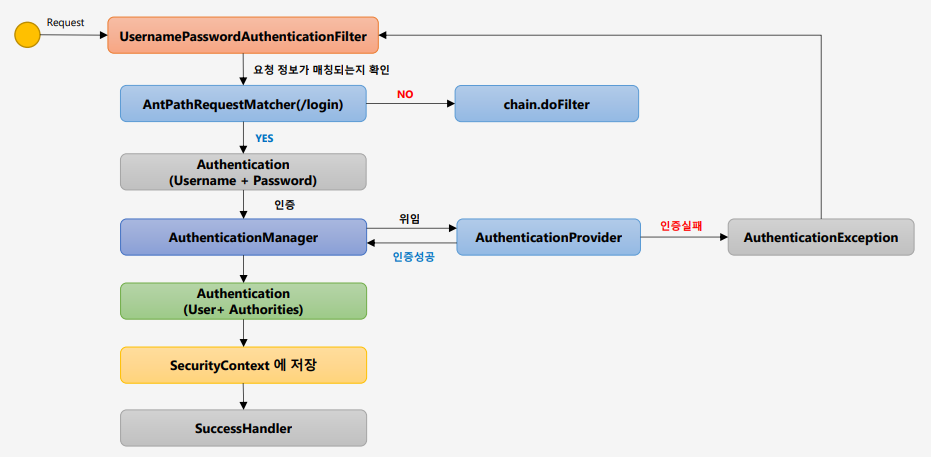
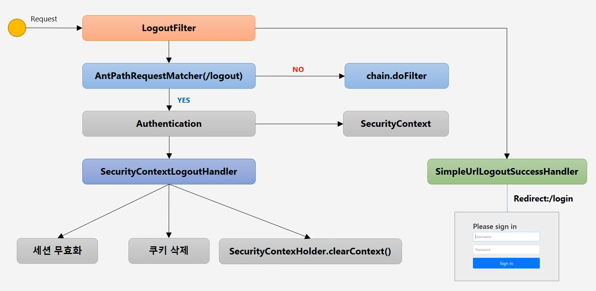
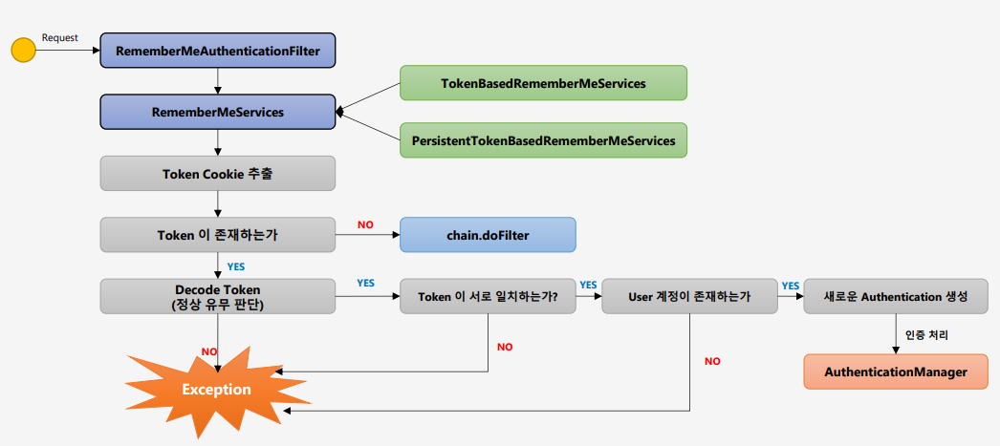
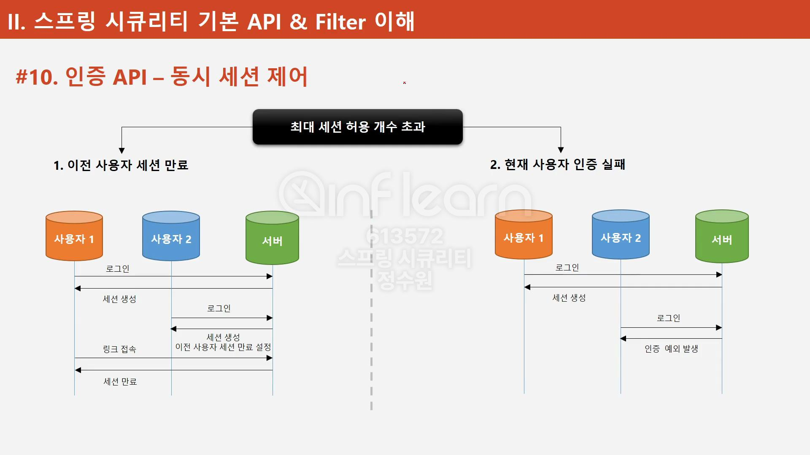
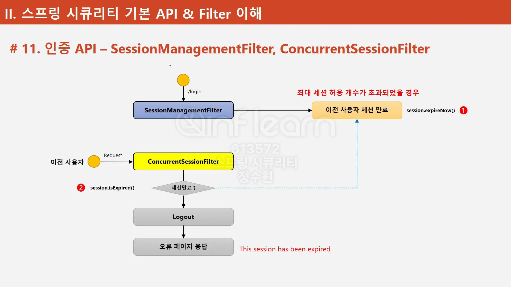

# Spring Security란?
- Spring Security는 Spring 기반의 보안 Framework이다.
- 보안 관련 기능을 구현 가능하게 한다.
- 인증, 인가를 처리하는 역할을 한다.

### 인증(Authentication) 
    - 신원을 검증
    - 인증 프로세스로 인증이 성공되면 시스템 엑세스가 가능

### 인가(Authorization)
    - 인증된 사용자가 요청한 자원에 접근 가능한지를 결정
    - 인증 성공 후 인가 절차가 이루어짐

## 1. WebSecurityConfigurerAdapter 설정
- 스프링 시큐리티의 웹 보안 기능의 초기화 및 설정을 도와준다.
- WebSecurityConfigurerAdapter를 상속받아 HttpSecurity 클래스를 사용한다.

## 2. FormLogin
- 스프링 시큐리티의 HttpSecurity 클래스의 formLogin을 이용해 인증 API를 도와준다.
- FormLogin의 <b>UsernamePasswordAuthenticationFilter</b>를 사용하여 인증처리를 한다.
    - AntPathRequestMatcher : 요청 정보와 매칭되는지 확인 
    - Authentication : 인증객체를 만들어 AuthenticationManager에게 전달하거나 인증된 객체를 받음
    - AuthenticationManager : 객체를 Authentication에게 받아 인증 처리를 Provider에 위임함
    - AuthenticationProvider : 인증 처리를 담당함
    - AuthenticationException : 인증 실패를 처리하여 예외처리함
    - SecurityContext : 인증된 객체를 저장함
    - SuccessHandler : 인증성공을 처리함

    
## 3. Logout
- Post 방식으로 로그아웃을 요청한다.
    - LogoutFilter : 로그아웃 요청을 처리해준다.
    - AntPathRequestMatcher : 로그아웃 url인지 검증해 준다
    - chain.doFilter : 로그아웃 url이 아니라면 로그아웃 처리를 하지 않고 다음 필터로 넘어간다
    - Authentication : <b>SecurityContext</b> 에서 사용자 객체를 가져옴
    - SecurityContext : 인증된 사용자의 객체가 담겨져있음
    - SecurityContextLogoutHandler : 세션 무효화, 쿠키 삭제 등을 처리한다.
    
    

## 4. Remember Me 인증
- 세션이 만료되고 웹 브라우저가 종료된 후에도 어플리케이션이 사용자를 기억하는 기능
- Remember-Me 쿠키에 대한 Http 요청을 확인한 후 토큰 기반 인증을 사용해 유효성을 검사하고 토큰이 검증되면 사용자는 로그인 된다.

    - rememberMeParameter("remember") : 기본 파라미터명
    - tokenValiditySeconds("3600") : rememberMe 쿠키 만료 시간 설정
    - alwaysRemeber(true) : rememberMe 기능이 활성화 할지 여부(default - true)
    - userDetailsService(userDetailsService) : rememberMe 기능 수행 시 시스템 사용자 계정 조회

- Remember Me Filter
    - RememberMeAuthenticationFilter : 인증 객체(SecurityContext)가 없는 경우 동작(인증 객체가 있다면 인증이 되어있는 상태라 RememberMe가 필요없음)
    - RememberMeServices : <b>TokenBasedRememberMeServices</b>와 <b>PersistentTokenBasedRememberMeService</b>로 RememberMe 인증처리
    - TokenBasedRememberMeServices : 브라우저에 토큰을 저장함(임시적)
    - PersistentTokenBasedRememberMeService : DB에 토큰을 저장함(영구적)
    

## 5. AnonymousAuthenticationFilter
- 익명 사용자와 인증 사용자를 구분하기 위한 필터
    - AnonymousAuthenticationFilter : 인증 객체(SecurityContext)가 없는 경우 익명 객체를 생성한다.
    

## 6. 인증 API - 동시 세션 제어
- 최대 세션 허용 개수를 초과하지 않고 유지할 수 있도록 하는 기능이 동시 세션 제어
    - 이전 사용자 세션 만료 : 최대 세션 허용 개수가 1개일 때 사용자 1이 세선을 얻은 후 사용자 2가 세션을 얻으면 사용자 1의 세션은 만료된다.
    - 현재 사용자 인증 실패 : 최대 세션 허용 개수가 1개일 때 사용자 1이 세선을 얻은 후 사용자 2가 세션을 얻으려 하면 인증 예외가 발생한다.
    
    - http.sessionManagement() : 세션 관리 기능을 관리
    - maximunSessions(1) : 
    - maxSessionsPreventsLogin(true) : true : 동시 로그인 차단(2번) / false : 기존 세션 만료(default)(1번)
    - invalidSessionUrl(/url) : 세션이 유효하지 않을 때 이동
    - expiredUrl(/url) : 세션이 만료될 경우 이동

## 7. 인증 API - 세션 고정 보호
- 인증에 성공할때마다 새로운 세션을 생성해주는 세션 제어
    - http.sessionManagement() : 세션 관리 기능을 관리
    - sessionFixation().changeSessionId() : 기존 세션에서 설정한것을 가져오되, 새로운 세션을 갱신해줌(기본값)
    - sessionFixation().newSession() : 기존 세션에서 설정한것을 초기화하고, 새로운 세션을 갱신해줌
    

## 7. 인증 API - 세션 정책
- Spring security가 세션을 관리및 제어 해주는 기능
    - SessinCreationPolicy.Always : 항상 세션 생성
    - SessinCreationPolicy.If_Required : 필요 시 생성(기본값)
    - SessinCreationPolicy.Never : 생성하지 않지만 이미 존재하면 사용
    - SessinCreationPolicy.Stateless : 생성하지 않고 존재해도 사용하지 않음

<!-- ## 8. 인증 API - SessionManagementFilter

 -->